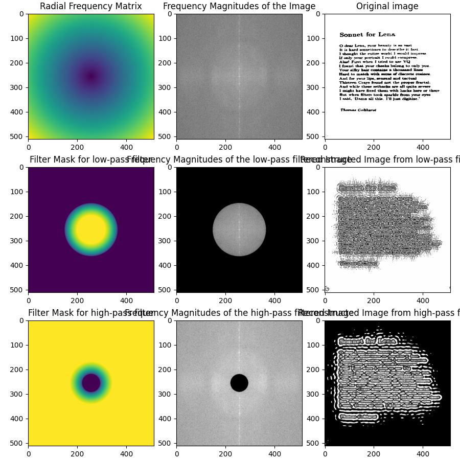

# Example of the low-pass and high-pass filters

## Parameters

- `fft-shift=True`
- `cutoff-frequency=0.2`
- `slope-type=gentle`

## Observations

### High Energy Along the Vertical Axis in the Frequency Domain

We see a bright vertical streak in the frequency magnitude plot because the image has large vertical variations,
namely the alternating text lines and empty spaces. This repeating pattern introduce strong low-frequency components
along the vertical axis in the frequency domain.

### Effect of Low-Pass Filtering

The low-pass filter keeps smooth gradients and removes high-frequency details like the sharp edges of the characters.
As a result, the text in the reconstructed image lost its sharpness.

### Effect of High-Pass Filtering

The high-pass filter only keeps sharp transitions, such as text edges and contours. As a result, the reconstructed
image shows only the text's edges.